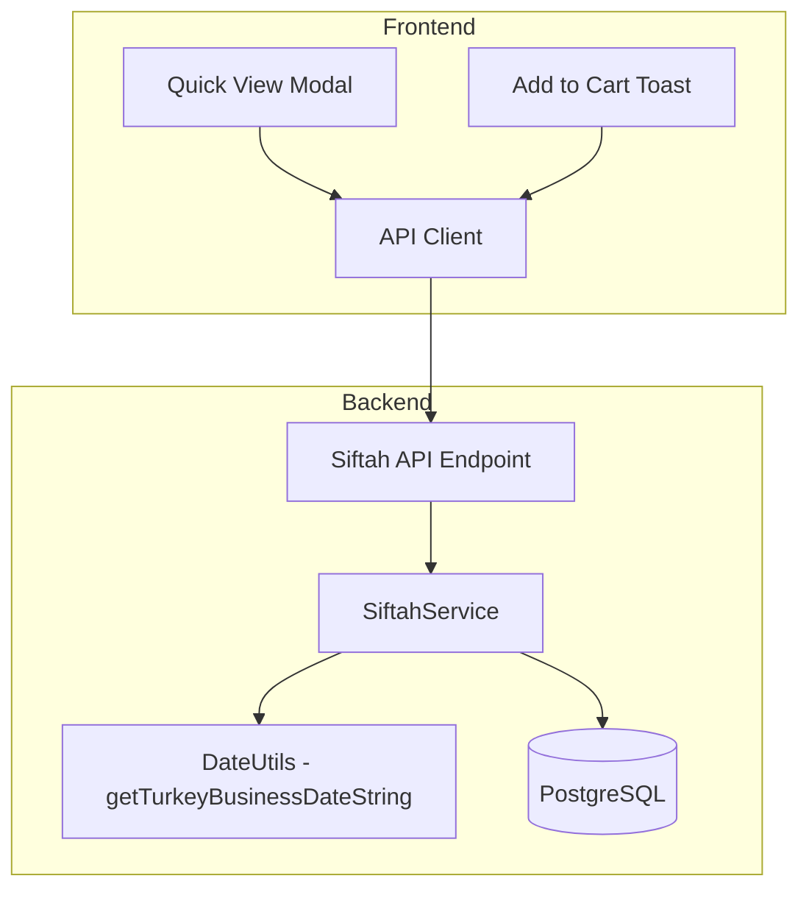
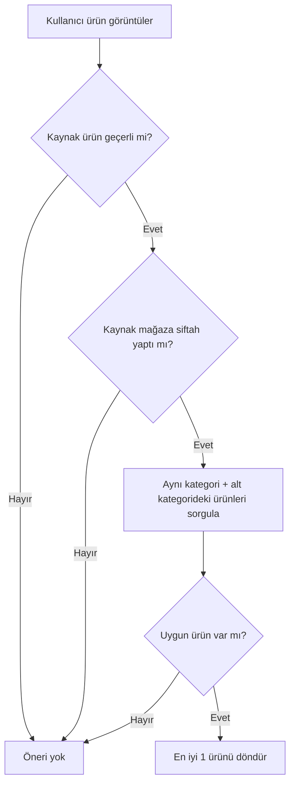

# Siftah Öneri Sistemi - Teknik Uygulama Planı (Revize v2)

## Genel Bakış

Bu döküman, e-ticaret pazaryerine "Siftah Kültürü"nü entegre edecek öneri sisteminin teknik planını içermektedir. Sistem, o gün henüz satış yapmamış mağazaların ürünlerini, uygun koşullardaki kullanıcılara alternatif olarak önerecektir.

> [!IMPORTANT]
> Bu plan **yalnızca PostgreSQL** kullanır. Redis veya başka bir cache mekanizması **yer almamaktadır**.

---

## 1. Sistem Mimarisi



### 1.1 Katmanlı Yapı

| Katman | Bileşen | Sorumluluk |
|--------|---------|------------|
| **API Layer** | `siftah.routes.js` | HTTP endpoint'leri, validation |
| **Service Layer** | `siftah.service.js` | İş mantığı, öneri algoritması |
| **Utility Layer** | `dateUtils.js` | Türkiye saat dilimi tarih hesaplama |
| **Data Layer** | PostgreSQL + Sequelize | Kalıcı veri saklama |

---

## 2. Tutarlı Tarih Fonksiyonu

Tüm sistemde "bugün" kavramı tek bir fonksiyonla hesaplanacaktır.

### 2.1 DateUtils Modülü

#### [NEW] [dateUtils.js](file:///c:/Users/LENOVO/Desktop/railvayk33/railvayk11/backend/src/utils/dateUtils.js)

```javascript
/**
 * Türkiye iş günü tarihi hesaplama
 * Tüm siftah işlemlerinde bu fonksiyon kullanılır
 * @returns {string} YYYY-MM-DD formatında Türkiye saatine göre tarih
 */
function getTurkeyBusinessDateString() {
  const now = new Date();
  
  // Türkiye UTC+3 offset (milisaniye cinsinden)
  const TURKEY_OFFSET_MS = 3 * 60 * 60 * 1000;
  
  // UTC zamanına Türkiye offset'ini ekle
  const turkeyTime = new Date(now.getTime() + now.getTimezoneOffset() * 60 * 1000 + TURKEY_OFFSET_MS);
  
  // YYYY-MM-DD formatına çevir
  const year = turkeyTime.getFullYear();
  const month = String(turkeyTime.getMonth() + 1).padStart(2, '0');
  const day = String(turkeyTime.getDate()).padStart(2, '0');
  
  return `${year}-${month}-${day}`;
}

module.exports = { getTurkeyBusinessDateString };
```

### 2.2 Kullanım Yerleri

Bu fonksiyon şu yerlerde kullanılacak:
- Sipariş ödeme hook'u (`order.service.js`)
- Siftah öneri algoritması (`siftah.service.js`)
- Günlük satış sorguları
- API endpoint'leri
- Tüm testler

---

## 3. Veri Modeli

### 3.1 Yeni Tablo: `store_daily_sales`

```sql
-- Migration: 20251209-add-store-daily-sales.js

CREATE TABLE store_daily_sales (
  id UUID PRIMARY KEY DEFAULT gen_random_uuid(),
  store_id UUID NOT NULL REFERENCES stores(id) ON DELETE CASCADE,
  sale_date DATE NOT NULL,
  successful_order_count INTEGER DEFAULT 0,
  first_order_at TIMESTAMP WITH TIME ZONE,
  last_order_at TIMESTAMP WITH TIME ZONE,
  created_at TIMESTAMP WITH TIME ZONE DEFAULT CURRENT_TIMESTAMP,
  updated_at TIMESTAMP WITH TIME ZONE DEFAULT CURRENT_TIMESTAMP,
  
  CONSTRAINT uq_store_daily_sales UNIQUE (store_id, sale_date)
);

-- Performans indeksleri
CREATE INDEX idx_sds_date ON store_daily_sales(sale_date);
CREATE INDEX idx_sds_store_date ON store_daily_sales(store_id, sale_date);
CREATE INDEX idx_sds_date_count ON store_daily_sales(sale_date, successful_order_count);
```

#### [NEW] [StoreDailySales.js](file:///c:/Users/LENOVO/Desktop/railvayk33/railvayk11/backend/src/models/StoreDailySales.js)

```javascript
const { DataTypes } = require('sequelize');
const { sequelize } = require('../config/sequelize');

const StoreDailySales = sequelize.define('StoreDailySales', {
  id: {
    type: DataTypes.UUID,
    defaultValue: DataTypes.UUIDV4,
    primaryKey: true
  },
  store_id: {
    type: DataTypes.UUID,
    allowNull: false,
    references: { model: 'stores', key: 'id' }
  },
  sale_date: {
    type: DataTypes.DATEONLY,
    allowNull: false
  },
  successful_order_count: {
    type: DataTypes.INTEGER,
    defaultValue: 0
  },
  first_order_at: {
    type: DataTypes.DATE,
    allowNull: true
  },
  last_order_at: {
    type: DataTypes.DATE,
    allowNull: true
  }
}, {
  tableName: 'store_daily_sales',
  indexes: [
    { unique: true, fields: ['store_id', 'sale_date'] },
    { fields: ['sale_date'] },
    { fields: ['sale_date', 'successful_order_count'] }
  ]
});

module.exports = StoreDailySales;
```

---

## 4. Günlük Satış Takibi - Upsert Mantığı

### 4.1 Seçilen Yaklaşım: ON CONFLICT SQL

**Gerekçe:** Tek atomik sorgu, race condition riski yok, PostgreSQL native desteği, en yüksek performans.

#### [MODIFY] [order.service.js](file:///c:/Users/LENOVO/Desktop/railvayk33/railvayk11/backend/src/services/order.service.js)

`markOrderPaid` fonksiyonuna eklenecek:

```javascript
const { getTurkeyBusinessDateString } = require('../utils/dateUtils');
const { sequelize } = require('../config/sequelize');

async function recordSiftahSale(storeId) {
  const today = getTurkeyBusinessDateString();
  
  await sequelize.query(`
    INSERT INTO store_daily_sales (id, store_id, sale_date, successful_order_count, first_order_at, last_order_at, created_at, updated_at)
    VALUES (gen_random_uuid(), :storeId, :today, 1, NOW(), NOW(), NOW(), NOW())
    ON CONFLICT (store_id, sale_date)
    DO UPDATE SET
      successful_order_count = store_daily_sales.successful_order_count + 1,
      last_order_at = NOW(),
      updated_at = NOW()
  `, {
    replacements: { storeId, today },
    type: sequelize.QueryTypes.INSERT
  });
}

// markOrderPaid içinde çağrılacak:
async markOrderPaid(orderId, paymentPayload = {}) {
  const order = await this._loadOrderWithRelations(orderId);
  
  // ... mevcut ödeme mantığı ...
  
  order.status = 'paid';
  order.payment_status = 'paid';
  order.paid_at = new Date();
  await order.save();
  
  // Siftah kaydı
  await recordSiftahSale(order.store_id);
  
  // ... mevcut event yayınlama ...
  
  return order;
}
```

---

## 5. Öneri Algoritması

### 5.1 Akış Diyagramı



### 5.2 Kategori Eşleştirme Kuralı

**Kesin Kural:** Yalnızca aşağıdaki iki durum kabul edilir:

1. **Aynı kategori**: Kaynak ürün ile önerilen ürün aynı `category_id`'ye sahip
2. **Aynı alt kategori**: Her iki ürün de aynı parent kategorinin alt kategorisinde

```javascript
async function getSameCategoryIds(categoryId) {
  const category = await Category.findByPk(categoryId);
  if (!category) return [];
  
  // Sadece aynı kategori
  const ids = [categoryId];
  
  // Eğer alt kategoriyse, aynı parent'ın diğer alt kategorilerini DE DAHİL ETME
  // Sadece birebir aynı kategori eşleşmesi
  
  return ids;
}
```

### 5.3 Mağaza Durum Filtreleri

Öneri sorgusunda mağaza şu koşulları sağlamalı:

| Koşul | Değer |
|-------|-------|
| `status` | `'approved'` |
| `is_active` | Stores tablosunda böyle alan yok, `status = 'approved'` yeterli |

**Not:** Mevcut `Store` modelinde `status` alanı şu değerleri alabilir: `'pending'`, `'approved'`, `'rejected'`, `'suspended'`. Sadece `'approved'` olanlar dahil edilecek.

### 5.4 Sıralama Mantığı (Deterministik)

```sql
ORDER BY
  rating DESC,           -- 1. En yüksek rating
  price ASC,             -- 2. En düşük fiyat
  created_at ASC         -- 3. En eski ürün (tie-breaker)
LIMIT 1
```

### 5.5 Siftah Service Implementasyonu

#### [NEW] [siftah.service.js](file:///c:/Users/LENOVO/Desktop/railvayk33/railvayk11/backend/src/services/siftah.service.js)

```javascript
const { Op } = require('sequelize');
const { Product, Store, Category } = require('../models');
const { sequelize } = require('../config/sequelize');
const { getTurkeyBusinessDateString } = require('../utils/dateUtils');

class SiftahService {
  
  /**
   * Mağazanın bugün siftah yapıp yapmadığını kontrol eder
   */
  async hasStoreMadeSiftah(storeId) {
    const today = getTurkeyBusinessDateString();
    
    const [result] = await sequelize.query(`
      SELECT successful_order_count
      FROM store_daily_sales
      WHERE store_id = :storeId AND sale_date = :today
    `, {
      replacements: { storeId, today },
      type: sequelize.QueryTypes.SELECT
    });
    
    return result && result.successful_order_count > 0;
  }
  
  /**
   * Bugün siftah yapmamış, aktif ve onaylı mağaza ID'lerini döndürür
   */
  async getNoSiftahStoreIds() {
    const today = getTurkeyBusinessDateString();
    
    const stores = await sequelize.query(`
      SELECT s.id
      FROM stores s
      LEFT JOIN store_daily_sales sds 
        ON s.id = sds.store_id AND sds.sale_date = :today
      WHERE s.status = 'approved'
        AND (sds.id IS NULL OR sds.successful_order_count = 0)
    `, {
      replacements: { today },
      type: sequelize.QueryTypes.SELECT
    });
    
    return stores.map(s => s.id);
  }
  
  /**
   * Siftah önerisi döndürür
   * @param {string} productId - Kaynak ürün ID
   * @returns {Object|null} Öneri objesi veya null
   */
  async getSiftahRecommendation(productId) {
    // 1. Kaynak ürünü al
    const sourceProduct = await Product.findByPk(productId, {
      include: [
        { model: Store, as: 'store' },
        { model: Category, as: 'category' }
      ]
    });
    
    // Kaynak ürün kontrolü
    if (!sourceProduct) {
      return { has_recommendation: false, reason: 'source_product_not_found' };
    }
    
    if (!sourceProduct.is_active || sourceProduct.status !== 'approved') {
      return { has_recommendation: false, reason: 'source_product_inactive' };
    }
    
    if (sourceProduct.stock <= 0) {
      return { has_recommendation: false, reason: 'source_product_out_of_stock' };
    }
    
    // Kaynak mağaza kontrolü
    if (!sourceProduct.store || sourceProduct.store.status !== 'approved') {
      return { has_recommendation: false, reason: 'source_store_not_approved' };
    }
    
    // 2. Kaynak mağaza siftah yaptı mı?
    const sourceStoreSiftahDone = await this.hasStoreMadeSiftah(sourceProduct.store_id);
    
    if (!sourceStoreSiftahDone) {
      return { has_recommendation: false, reason: 'source_store_no_siftah' };
    }
    
    // 3. Siftah yapmamış mağazaları bul
    const noSiftahStoreIds = await this.getNoSiftahStoreIds();
    
    if (noSiftahStoreIds.length === 0) {
      return { has_recommendation: false, reason: 'no_siftah_stores_available' };
    }
    
    // 4. Fiyat üst limiti (%50 fazla)
    const maxPrice = parseFloat(sourceProduct.price) * 1.5;
    
    // 5. Öneri sorgusu - Tek ürün
    const recommendation = await Product.findOne({
      where: {
        id: { [Op.ne]: productId },
        store_id: { [Op.in]: noSiftahStoreIds },
        category_id: sourceProduct.category_id, // Sadece aynı kategori
        status: 'approved',
        is_active: true,
        stock: { [Op.gt]: 0 },
        rating: { [Op.gte]: 3.5 },
        price: { [Op.lte]: maxPrice }
      },
      include: [
        { 
          model: Store, 
          as: 'store', 
          attributes: ['id', 'name', 'slug', 'logo', 'rating'],
          where: { status: 'approved' }
        },
        { 
          model: Category, 
          as: 'category', 
          attributes: ['id', 'name', 'slug'] 
        }
      ],
      order: [
        ['rating', 'DESC'],
        ['price', 'ASC'],
        ['created_at', 'ASC']
      ]
    });
    
    if (!recommendation) {
      return { has_recommendation: false, reason: 'no_eligible_products' };
    }
    
    // 6. Response oluştur
    return {
      has_recommendation: true,
      product: this.serializeProduct(recommendation, sourceProduct)
    };
  }
  
  serializeProduct(product, sourceProduct) {
    const priceDiff = parseFloat(product.price) - parseFloat(sourceProduct.price);
    const priceDiffPercent = Math.round((priceDiff / parseFloat(sourceProduct.price)) * 100);
    
    return {
      id: product.id,
      title: product.title,
      slug: product.slug,
      price: parseFloat(product.price),
      compare_price: product.compare_price ? parseFloat(product.compare_price) : null,
      rating: parseFloat(product.rating),
      total_reviews: product.total_reviews,
      images: product.images || [],
      stock: product.stock,
      store: {
        id: product.store.id,
        name: product.store.name,
        slug: product.store.slug,
        logo: product.store.logo,
        rating: parseFloat(product.store.rating)
      },
      category: {
        id: product.category.id,
        name: product.category.name,
        slug: product.category.slug
      },
      price_comparison: {
        difference: priceDiff,
        percentage: priceDiffPercent,
        label: priceDiff < 0 
          ? `₺${Math.abs(priceDiff).toFixed(2)} daha uygun`
          : priceDiff > 0 
            ? `₺${priceDiff.toFixed(2)} fark`
            : 'Aynı fiyat'
      },
      siftah_message: 'Bu mağazanın bugün ilk müşterisi olun!'
    };
  }
}

module.exports = new SiftahService();
```

---

## 6. API Tasarımı

### 6.1 Endpoint

#### `GET /api/siftah/recommendations`

**Query Parameters:**

| Parametre | Tip | Zorunlu | Açıklama |
|-----------|-----|---------|----------|
| `product_id` | UUID | Evet | Kullanıcının baktığı ürün ID'si |

**Response (Öneri var):**

```json
{
  "success": true,
  "data": {
    "has_recommendation": true,
    "product": {
      "id": "uuid",
      "title": "Önerilen Ürün",
      "slug": "onerilen-urun",
      "price": 120.00,
      "compare_price": null,
      "rating": 4.2,
      "total_reviews": 15,
      "images": ["url1", "url2"],
      "stock": 5,
      "store": {
        "id": "uuid",
        "name": "B Mağazası",
        "slug": "b-magazasi",
        "logo": "url",
        "rating": 4.5
      },
      "category": {
        "id": "uuid",
        "name": "Kategori",
        "slug": "kategori"
      },
      "price_comparison": {
        "difference": -30.00,
        "percentage": -20,
        "label": "₺30.00 daha uygun"
      },
      "siftah_message": "Bu mağazanın bugün ilk müşterisi olun!"
    }
  }
}
```

**Response (Öneri yok):**

```json
{
  "success": true,
  "data": {
    "has_recommendation": false,
    "reason": "source_store_no_siftah"
  }
}
```

**Olası `reason` değerleri:**

| Değer | Açıklama |
|-------|----------|
| `source_product_not_found` | Ürün bulunamadı |
| `source_product_inactive` | Ürün aktif değil veya onaysız |
| `source_product_out_of_stock` | Ürün stokta yok |
| `source_store_not_approved` | Mağaza onaylı değil |
| `source_store_no_siftah` | Kaynak mağaza henüz siftah yapmamış |
| `no_siftah_stores_available` | Tüm mağazalar bugün satış yapmış |
| `no_eligible_products` | Kriterlere uyan ürün yok |

### 6.2 Route ve Controller

#### [NEW] [siftah.routes.js](file:///c:/Users/LENOVO/Desktop/railvayk33/railvayk11/backend/src/routes/siftah.routes.js)

```javascript
const express = require('express');
const router = express.Router();
const siftahController = require('../controllers/siftah.controller');
const { optionalAuth } = require('../middlewares/auth');
const { validateQuery } = require('../middlewares/validate');
const { siftahQuerySchema } = require('../validators/siftah.validator');

router.get(
  '/recommendations',
  optionalAuth,
  validateQuery(siftahQuerySchema),
  siftahController.getRecommendations
);

module.exports = router;
```

#### [NEW] [siftah.controller.js](file:///c:/Users/LENOVO/Desktop/railvayk33/railvayk11/backend/src/controllers/siftah.controller.js)

```javascript
const siftahService = require('../services/siftah.service');
const { StatusCodes } = require('http-status-codes');

class SiftahController {
  async getRecommendations(req, res, next) {
    try {
      const { product_id } = req.query;
      
      const result = await siftahService.getSiftahRecommendation(product_id);
      
      res.status(StatusCodes.OK).json({
        success: true,
        data: result
      });
    } catch (error) {
      next(error);
    }
  }
}

module.exports = new SiftahController();
```

#### [NEW] [siftah.validator.js](file:///c:/Users/LENOVO/Desktop/railvayk33/railvayk11/backend/src/validators/siftah.validator.js)

```javascript
const Joi = require('joi');

const siftahQuerySchema = Joi.object({
  product_id: Joi.string().uuid().required()
});

module.exports = { siftahQuerySchema };
```

---

## 7. Frontend Entegrasyonu

### 7.1 Quick View Modal

```javascript
// main.js veya quick-view.js

async function openQuickView(productId) {
  // Mevcut modal içerik yükleme...
  
  // Siftah önerisini al (PostgreSQL'den gerçek zamanlı)
  try {
    const response = await fetch(`/api/siftah/recommendations?product_id=${productId}`);
    const data = await response.json();
    
    if (data.success && data.data.has_recommendation) {
      renderSiftahCard(data.data.product);
    } else {
      // Öneri yok, siftah kartını gösterme
      hideSiftahCard();
    }
  } catch (error) {
    console.warn('Siftah API error:', error);
    hideSiftahCard();
  }
}

function renderSiftahCard(product) {
  const container = document.querySelector('.quick-view-modal .modal-body');
  
  const html = `
    <div class="siftah-card" id="siftah-card">
      <div class="siftah-header">
        <span class="siftah-icon">🌟</span>
        <span>Alternatif Öneri</span>
      </div>
      <div class="siftah-body">
        
        <div class="siftah-info">
          <h4>${product.title}</h4>
          <p class="store">${product.store.name}</p>
          <p class="price">₺${product.price.toFixed(2)}</p>
          <span class="badge">${product.siftah_message}</span>
          ${product.price_comparison.difference < 0 
            ? `<span class="savings">${product.price_comparison.label}</span>` 
            : ''}
        </div>
      </div>
      <a href="/pages/product.html?slug=${product.slug}" class="siftah-btn">İncele</a>
    </div>
  `;
  
  container.insertAdjacentHTML('beforeend', html);
}

function hideSiftahCard() {
  const card = document.getElementById('siftah-card');
  if (card) card.remove();
}
```

### 7.2 Sepete Ekle Sonrası Toast

```javascript
// cart.js veya main.js

async function addToCart(productId, quantity, variant) {
  // Mevcut sepete ekleme mantığı...
  
  // Başarılı ekleme sonrası siftah kontrolü
  try {
    const response = await fetch(`/api/siftah/recommendations?product_id=${productId}`);
    const data = await response.json();
    
    if (data.success && data.data.has_recommendation) {
      showSiftahToast(data.data.product);
    }
  } catch (error) {
    console.warn('Siftah toast error:', error);
  }
}

function showSiftahToast(product) {
  // Mevcut toast varsa kaldır
  closeSiftahToast();
  
  const html = `
    <div class="siftah-toast" id="siftah-toast">
      <button class="close-btn" onclick="closeSiftahToast()">×</button>
      <div class="toast-header">🌟 Alternatif önerimiz var!</div>
      <div class="toast-body">
        
        <div>
          <p class="title">${product.title}</p>
          <p class="store">${product.store.name}</p>
          <p class="price">₺${product.price.toFixed(2)}</p>
          <span class="badge">${product.siftah_message}</span>
        </div>
      </div>
      <a href="/pages/product.html?slug=${product.slug}" class="view-btn">Ürünü İncele</a>
    </div>
  `;
  
  document.body.insertAdjacentHTML('beforeend', html);
  
  // 8 saniye sonra otomatik kapat
  setTimeout(closeSiftahToast, 8000);
}

function closeSiftahToast() {
  const toast = document.getElementById('siftah-toast');
  if (toast) {
    toast.classList.add('fade-out');
    setTimeout(() => toast.remove(), 300);
  }
}
```

---

## 8. Performans Optimizasyonu

### 8.1 Veritabanı İndeksleri

```sql
-- Siftah yapmamış mağaza sorgusu için
CREATE INDEX idx_sds_date_count_zero ON store_daily_sales(sale_date) 
WHERE successful_order_count = 0;

-- Öneri sorgusu için composite index
CREATE INDEX idx_products_siftah_query ON products(
  category_id, 
  status, 
  is_active, 
  rating DESC, 
  price ASC, 
  created_at ASC
) WHERE status = 'approved' AND is_active = true AND stock > 0 AND rating >= 3.5;

-- Mağaza durum filtresi için
CREATE INDEX idx_stores_approved ON stores(id) WHERE status = 'approved';
```

### 8.2 Sorgu Analizi

Öneri sorgusu tek bir DB round-trip'te çalışır:
1. `hasStoreMadeSiftah()`: 1 sorgu
2. `getNoSiftahStoreIds()`: 1 sorgu
3. `Product.findOne()`: 1 sorgu (JOIN ile store ve category dahil)

**Toplam: 3 sorgu** (cache olmadan, ama indekslerle optimize)

---

## 9. Edge Case Analizleri

### 9.1 Tüm Edge Case'ler

| Senaryo | Davranış | Reason Değeri |
|---------|----------|---------------|
| Kaynak ürün bulunamadı | Öneri yok | `source_product_not_found` |
| Kaynak ürün pasif (`is_active = false`) | Öneri yok | `source_product_inactive` |
| Kaynak ürün onaysız (`status != 'approved'`) | Öneri yok | `source_product_inactive` |
| Kaynak ürün stokta yok | Öneri yok | `source_product_out_of_stock` |
| Kaynak mağaza onaysız/suspended | Öneri yok | `source_store_not_approved` |
| Kaynak mağaza henüz siftah yapmamış | Öneri yok | `source_store_no_siftah` |
| Tüm mağazalar bugün satış yapmış | Öneri yok | `no_siftah_stores_available` |
| Aynı kategoride siftah yapmamış mağaza yok | Öneri yok | `no_eligible_products` |
| Uygun mağaza var ama rating < 3.5 | Öneri yok | `no_eligible_products` |
| Uygun mağaza var ama fiyat > %50 fazla | Öneri yok | `no_eligible_products` |
| Uygun mağaza var ama stok = 0 | Öneri yok | `no_eligible_products` |

### 9.2 Gün İçi Satış Değişikliği

Bir mağaza gün içinde ilk satışını yaptığında:
- `store_daily_sales` tablosu güncellenir
- Sonraki öneri isteklerinde bu mağaza artık "siftah yapmış" olarak görülür
- **PostgreSQL'den gerçek zamanlı sorgu yapıldığı için tutarsızlık riski yoktur**

---

## 10. Dosya Değişiklikleri Özeti

### Yeni Dosyalar

| Dosya | Açıklama |
|-------|----------|
| `backend/src/utils/dateUtils.js` | Türkiye saat dilimi tarih fonksiyonu |
| `backend/src/models/StoreDailySales.js` | Günlük satış modeli |
| `backend/src/services/siftah.service.js` | Siftah iş mantığı |
| `backend/src/controllers/siftah.controller.js` | API controller |
| `backend/src/routes/siftah.routes.js` | API routes |
| `backend/src/validators/siftah.validator.js` | Request validation |
| `backend/migrations/20251209-add-store-daily-sales.js` | DB migration |
| `assets/css/siftah.css` | Frontend stilleri |

### Değiştirilecek Dosyalar

| Dosya | Değişiklik |
|-------|------------|
| `backend/src/models/index.js` | StoreDailySales import ve association |
| `backend/src/services/order.service.js` | `recordSiftahSale()` hook ekleme |
| `backend/src/app.js` | Siftah route ekleme |
| `assets/js/main.js` | Quick View ve toast entegrasyonu |

---

## 11. Test Planı

### 11.1 Unit Testler

```javascript
describe('SiftahService', () => {
  describe('hasStoreMadeSiftah', () => {
    test('true döner - mağaza bugün satış yapmış', async () => {});
    test('false döner - mağaza bugün satış yapmamış', async () => {});
    test('Türkiye saatine göre doğru gün kontrol edilir', async () => {});
  });
  
  describe('getSiftahRecommendation', () => {
    test('null döner - kaynak mağaza siftah yapmamış', async () => {});
    test('öneri döner - tüm kriterler sağlanıyor', async () => {});
    test('null döner - aynı kategoride uygun ürün yok', async () => {});
    test('null döner - fiyat limiti aşılıyor (>%50)', async () => {});
    test('null döner - rating < 3.5', async () => {});
    test('null döner - stok = 0', async () => {});
    test('sıralama doğru - rating DESC, price ASC, created_at ASC', async () => {});
  });
  
  describe('getNoSiftahStoreIds', () => {
    test('sadece approved mağazalar döner', async () => {});
    test('suspended mağazalar dahil edilmez', async () => {});
  });
});

describe('getTurkeyBusinessDateString', () => {
  test('YYYY-MM-DD formatında döner', () => {});
  test('UTC+3 offset doğru uygulanır', () => {});
});
```

### 11.2 Integration Test

```javascript
describe('Siftah API', () => {
  test('GET /api/siftah/recommendations - geçerli öneri döner', async () => {});
  test('GET /api/siftah/recommendations - geçersiz product_id 400 döner', async () => {});
  test('Sipariş ödendikten sonra store_daily_sales güncellenir', async () => {});
});
```

### 11.3 Manuel Test Senaryoları

1. **Siftah Önerisi Gösterme:**
   - MağazaA'ya sipariş ver ve öde
   - MağazaB'ye sipariş verme
   - MağazaA ürününe Quick View aç
   - MağazaB ürünü öneri olarak görünmeli

2. **Fiyat Limiti Testi:**
   - Kaynak ürün: ₺100
   - Aday ürün 1: ₺160 (önerilmemeli)
   - Aday ürün 2: ₺140 (önerilmeli)

3. **Gün Geçişi Testi:**
   - Gece yarısından sonra tüm mağazalar siftah yapmamış olarak görünmeli

---

## 12. Verification Plan

### Automated Tests
```bash
cd c:\Users\LENOVO\Desktop\railvayk33\railvayk11\backend
npm test -- --testPathPattern=siftah
```

### Database Migration Test
```bash
cd c:\Users\LENOVO\Desktop\railvayk33\railvayk11\backend
npx sequelize-cli db:migrate
```

### API Endpoint Test
```bash
curl "http://localhost:3000/api/siftah/recommendations?product_id=<test-uuid>"
```
