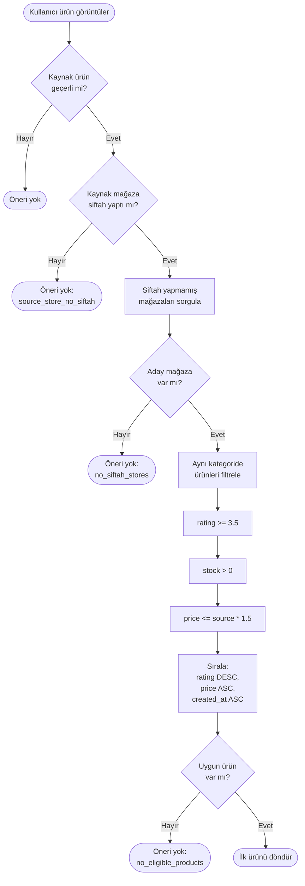

# Siftah Öneri Sistemi
## Eğitim ve Teknik Öğretim Dokümanı

Bu doküman, "Siftah" (günün ilk satışı) öneri sisteminin **nasıl düşünülerek tasarlandığını**, **nasıl uygulandığını** ve **başka projelere nasıl uyarlanabileceğini** öğreten kapsamlı bir teknik rehberdir.

---

# İçindekiler

1. [Giriş ve Motivasyon](#1-giriş-ve-motivasyon)
2. [Veritabanı Tasarım Eğitimi](#2-veritabanı-tasarım-eğitimi)
3. [Backend Mimari Rehberi](#3-backend-mimari-rehberi)
4. [Algoritma Mühendisliği](#4-algoritma-mühendisliği)
5. [API Tasarım Standartları](#5-api-tasarım-standartları)
6. [UI Entegrasyonu](#6-ui-entegrasyonu)
7. [Proje Dosya Yapısı](#7-proje-dosya-yapısı)
8. [Adım Adım Uygulama Rehberi](#8-adım-adım-uygulama-rehberi)
9. [Test Stratejisi](#9-test-stratejisi)
10. [Genelleştirilmiş Best Practices](#10-genelleştirilmiş-best-practices)
11. [Son Güncellemeler ve Bug Fix'ler](#11-son-güncellemeler-ve-bug-fixler)
12. [Değişiklik Geçmişi (Changelog)](#12-değişiklik-geçmişi-changelog)
13. [Bilinen Sorunlar ve Gelecek Planları](#13-bilinen-sorunlar-ve-gelecek-planları)

---

# 1. Giriş ve Motivasyon

## 1.1 Problem Tanımı

E-ticaret platformlarında bazı mağazalar günün başlarında satış yapamayabilir. Türk kültüründe "siftah" kavramı, günün ilk satışının uğurlu olduğunu ifade eder. Bu sistem, henüz günlük satış yapmamış mağazaların ürünlerini uygun kullanıcılara önererek:

- Mağaza dağılımını dengelemeyi
- Küçük mağazalara görünürlük sağlamayı
- Kullanıcılara alternatif kaliteli ürünler sunmayı

amaçlar.

## 1.2 Tasarım Kararları ve Gerekçeleri

### Neden Redis Kullanmadık?

| Seçenek | Avantaj | Dezavantaj | Kararımız |
|---------|---------|------------|-----------|
| Redis Cache | Hızlı okuma | Ek altyapı, TTL yönetimi, tutarsızlık riski | ❌ |
| PostgreSQL Only | Tek kaynak, tutarlılık, basitlik | Her sorguda DB erişimi | ✅ |

**Karar Gerekçesi:** Siftah durumu gün içinde dinamik olarak değişir. Redis kullanılsaydı, bir mağaza satış yaptığında cache invalidation gerekecekti. Bu karmaşıklık yerine, doğru indekslerle optimize edilmiş PostgreSQL sorguları tercih edildi.

> [!TIP]
> **Başka Projelerde:** Eğer saniyede binlerce istek bekliyorsanız ve veri 5-10 dakika eski olabilirse, Redis katmanı ekleyebilirsiniz. Ancak gerçek zamanlı doğruluk önemliyse, doğrudan veritabanı sorgusu tercih edin.

### Neden Günlük Tablo (store_daily_sales)?

**Alternatif 1: Orders tablosundan aggregate**
```sql
-- Her sorguda tüm orders tablosunu tarar
SELECT store_id, COUNT(*) FROM orders 
WHERE DATE(created_at) = CURRENT_DATE AND status = 'paid'
GROUP BY store_id
```
❌ **Dezavantaj:** Büyük orders tablosunda yavaş, index kullanımı zor.

**Alternatif 2: Store tablosuna today_sales kolonu**
```sql
-- Store tablosuna ek kolon
ALTER TABLE stores ADD COLUMN today_sales INTEGER DEFAULT 0;
```
❌ **Dezavantaj:** Gece yarısı reset mekanizması gerekli, race condition riski.

**Seçilen Yaklaşım: Ayrı günlük tablo**
```sql
CREATE TABLE store_daily_sales (
  store_id UUID,
  sale_date DATE,
  successful_order_count INTEGER
);
```
✅ **Avantaj:** 
- Tarihsel veri korunur
- Indeks ile hızlı sorgulama
- Gece yarısı reset gerekmez (yeni gün = yeni satır)

---

# 2. Veritabanı Tasarım Eğitimi

## 2.1 Tablo Tasarım Kararları

### store_daily_sales Tablosu

```sql
CREATE TABLE store_daily_sales (
  id UUID PRIMARY KEY DEFAULT gen_random_uuid(),
  store_id UUID NOT NULL REFERENCES stores(id) ON DELETE CASCADE,
  sale_date DATE NOT NULL,
  successful_order_count INTEGER DEFAULT 0,
  first_order_at TIMESTAMP WITH TIME ZONE,
  last_order_at TIMESTAMP WITH TIME ZONE,
  created_at TIMESTAMP WITH TIME ZONE DEFAULT CURRENT_TIMESTAMP,
  updated_at TIMESTAMP WITH TIME ZONE DEFAULT CURRENT_TIMESTAMP,
  
  CONSTRAINT uq_store_daily_sales UNIQUE (store_id, sale_date)
);
```

### Kolon Seçim Gerekçeleri

| Kolon | Neden Gerekli? | Alternatif | Neden Bu? |
|-------|----------------|------------|-----------|
| `id` | Primary key | Composite key | UUID ile tutarlılık, ORM uyumluluğu |
| `store_id` | Mağaza referansı | - | Zorunlu |
| `sale_date` | Gün bazlı takip | `created_at` kullanımı | DATE tipi indeks için optimal |
| `successful_order_count` | Sayaç | Boolean `has_siftah` | Gelecekte analitik için faydalı |
| `first_order_at` | İlk satış zamanı | - | Analitik, debugging |
| `last_order_at` | Son güncelleme | - | Concurrency kontrolü |

## 2.2 Index Stratejisi

```sql
-- 1. Unique Constraint (otomatik index oluşturur)
CONSTRAINT uq_store_daily_sales UNIQUE (store_id, sale_date)

-- 2. Tarih bazlı sorgular için
CREATE INDEX idx_sds_date ON store_daily_sales(sale_date);

-- 3. Siftah yapmamış mağazaları bulmak için
CREATE INDEX idx_sds_date_count ON store_daily_sales(sale_date, successful_order_count);
```

### Index Seçim Mantığı

**Sorgu 1:** "Bu mağaza bugün satış yaptı mı?"
```sql
SELECT * FROM store_daily_sales 
WHERE store_id = ? AND sale_date = ?
```
→ `UNIQUE (store_id, sale_date)` bu sorguyu O(log n) yapar.

**Sorgu 2:** "Bugün siftah yapmamış mağazalar kimler?"
```sql
SELECT s.id FROM stores s
LEFT JOIN store_daily_sales sds ON s.id = sds.store_id AND sds.sale_date = ?
WHERE sds.id IS NULL OR sds.successful_order_count = 0
```
→ `idx_sds_date_count` LEFT JOIN performansını artırır.

> [!IMPORTANT]
> **Partial Index Alternatifi:** Eğer sadece "siftah yapmamış" sorguları önemliyse:
> ```sql
> CREATE INDEX idx_sds_no_siftah ON store_daily_sales(sale_date) 
> WHERE successful_order_count = 0;
> ```
> Bu, disk alanı tasarrufu sağlar ama esnekliği azaltır.

## 2.3 UNIQUE Constraint Neden Kritik?

```sql
CONSTRAINT uq_store_daily_sales UNIQUE (store_id, sale_date)
```

Bu constraint üç önemli işlev görür:

1. **Veri Bütünlüğü:** Aynı mağaza-gün kombinasyonu için birden fazla kayıt oluşturulamaz.

2. **ON CONFLICT Desteği:** Upsert işlemini mümkün kılar:
   ```sql
   INSERT INTO store_daily_sales (...)
   ON CONFLICT (store_id, sale_date)
   DO UPDATE SET successful_order_count = successful_order_count + 1
   ```

3. **Otomatik B-Tree Index:** Unique constraint PostgreSQL'de otomatik olarak index oluşturur.

## 2.4 ON CONFLICT vs Transaction

### Seçenek A: Transaction ile Upsert
```javascript
await sequelize.transaction(async (t) => {
  const existing = await StoreDailySales.findOne({
    where: { store_id, sale_date },
    lock: true,
    transaction: t
  });
  
  if (existing) {
    existing.successful_order_count += 1;
    await existing.save({ transaction: t });
  } else {
    await StoreDailySales.create({ store_id, sale_date, ... }, { transaction: t });
  }
});
```
❌ **Dezavantaj:** 2 query, lock contention riski, daha fazla kod.

### Seçenek B: ON CONFLICT (Seçilen)
```sql
INSERT INTO store_daily_sales (...)
VALUES (...)
ON CONFLICT (store_id, sale_date)
DO UPDATE SET
  successful_order_count = store_daily_sales.successful_order_count + 1
```
✅ **Avantaj:** Tek atomik sorgu, race condition yok, performans.

> [!TIP]
> **Başka Projelerde:** Daily counters, rate limiting, session tracking gibi senaryolarda ON CONFLICT pattern'ini tercih edin.

## 2.5 Migration Dosyası Anatomisi

```
📁 backend/src/migrations/
└── 20251209-add-store-daily-sales.js
```

**Dosya:** [20251209-add-store-daily-sales.js](file:///c:/Users/LENOVO/Desktop/railvayk33/railvayk11/backend/src/migrations/20251209-add-store-daily-sales.js)

```javascript
'use strict';

module.exports = {
  async up(queryInterface, Sequelize) {
    // 1. Tablo oluştur
    await queryInterface.createTable('store_daily_sales', {
      id: {
        type: Sequelize.UUID,
        defaultValue: Sequelize.literal('gen_random_uuid()'),
        primaryKey: true,
      },
      store_id: {
        type: Sequelize.UUID,
        allowNull: false,
        references: { model: 'stores', key: 'id' },
        onDelete: 'CASCADE',
      },
      // ... diğer kolonlar
    });

    // 2. Unique constraint ekle (ON CONFLICT için zorunlu)
    await queryInterface.addConstraint('store_daily_sales', {
      fields: ['store_id', 'sale_date'],
      type: 'unique',
      name: 'uq_store_daily_sales',
    });

    // 3. Performans indexleri ekle
    await queryInterface.addIndex('store_daily_sales', ['sale_date'], {
      name: 'idx_sds_date',
    });
  },

  async down(queryInterface) {
    // Rollback: tabloyu sil (cascade ile indexler de silinir)
    await queryInterface.dropTable('store_daily_sales');
  },
};
```

### Migration Best Practices

1. **Adlandırma:** `YYYYMMDD-açıklayıcı-isim.js` formatı
2. **Atomiklik:** Bir migration tek bir mantıksal değişiklik yapmalı
3. **Rollback:** Her `up` için çalışan bir `down` olmalı
4. **Idempotent:** Aynı migration iki kez çalışmamalı (Sequelize bunu otomatik yönetir)

---

# 3. Backend Mimari Rehberi

## 3.1 Katmanlı Mimari (Layered Architecture)

```
┌─────────────────────────────────────────────────────────┐
│                    Routes (API Layer)                    │
│   Sorumlu: URL routing, middleware, validation           │
├─────────────────────────────────────────────────────────┤
│                  Controller (Handler Layer)              │
│   Sorumlu: Request/Response, HTTP status codes           │
├─────────────────────────────────────────────────────────┤
│                   Service (Business Layer)               │
│   Sorumlu: İş mantığı, algoritma, orchestration          │
├─────────────────────────────────────────────────────────┤
│                    Model (Data Layer)                    │
│   Sorumlu: Veritabanı şeması, ilişkiler                  │
└─────────────────────────────────────────────────────────┘
```

### Neden Bu Yapı?

| Katman | Tek Sorumluluk | Test Edilebilirlik |
|--------|----------------|---------------------|
| Routes | URL → Handler eşleme | Integration test |
| Controller | HTTP protokolü | Mock service ile unit test |
| Service | İş kuralları | Mock DB ile unit test |
| Model | Veri şeması | Schema validation |

## 3.2 Service Layer Detayları

**Dosya:** [siftah.service.js](file:///c:/Users/LENOVO/Desktop/railvayk33/railvayk11/backend/src/services/siftah.service.js)

### Fonksiyon: hasStoreMadeSiftah()

```javascript
async hasStoreMadeSiftah(storeId) {
  const today = getTurkeyBusinessDateString();
  
  const [result] = await sequelize.query(`
    SELECT successful_order_count
    FROM store_daily_sales
    WHERE store_id = :storeId AND sale_date = :today
  `, {
    replacements: { storeId, today },
    type: sequelize.QueryTypes.SELECT
  });
  
  return result && result.successful_order_count > 0;
}
```

| Soru | Cevap |
|------|-------|
| **Ne yapar?** | Mağazanın bugün satış yapıp yapmadığını kontrol eder |
| **Ne zaman çağrılır?** | Öneri algoritmasının ilk adımında |
| **Edge case?** | Kayıt yoksa `result` undefined olur → `false` döner |
| **Reuse?** | Herhangi bir "günlük durum kontrolü" için adapte edilebilir |

### Fonksiyon: getNoSiftahStoreIds()

```javascript
async getNoSiftahStoreIds() {
  const today = getTurkeyBusinessDateString();
  
  const stores = await sequelize.query(`
    SELECT s.id
    FROM stores s
    LEFT JOIN store_daily_sales sds 
      ON s.id = sds.store_id AND sds.sale_date = :today
    WHERE s.status = 'approved'
      AND (sds.id IS NULL OR sds.successful_order_count = 0)
  `, { ... });
  
  return stores.map(s => s.id);
}
```

| Soru | Cevap |
|------|-------|
| **Ne yapar?** | Bugün siftah yapmamış TÜM onaylı mağazaları bulur |
| **LEFT JOIN neden?** | `store_daily_sales`'te kayıt olmayan mağazaları da yakalar |
| **Performans?** | Indeksli JOIN, stores sayısı × 1 complexity |

### Fonksiyon: getSiftahRecommendation()

Bu ana orkestrasyon fonksiyonudur. Tüm iş mantığını bir araya getirir.

```javascript
async getSiftahRecommendation(productId) {
  // 1. Validasyonlar
  const sourceProduct = await Product.findByPk(productId, { include: [...] });
  if (!sourceProduct) return { has_recommendation: false, reason: 'source_product_not_found' };
  
  // 2. Kaynak mağaza siftah kontrolü
  const sourceStoreSiftahDone = await this.hasStoreMadeSiftah(sourceProduct.store_id);
  if (!sourceStoreSiftahDone) return { has_recommendation: false, reason: 'source_store_no_siftah' };
  
  // 3. Aday mağazaları bul
  const noSiftahStoreIds = await this.getNoSiftahStoreIds();
  
  // 4. Ürün sorgula ve döndür
  const recommendation = await Product.findOne({ where: { ... }, order: [...] });
  return recommendation ? { has_recommendation: true, product: ... } : { ... };
}
```

### Fonksiyon Bölme İlkeleri

1. **Tek Sorumluluk:** Her fonksiyon tek bir iş yapar
2. **Test Edilebilirlik:** Alt fonksiyonlar bağımsız test edilebilir
3. **Reusability:** `hasStoreMadeSiftah` başka yerlerde de kullanılabilir

## 3.3 Controller Pattern

**Dosya:** [siftah.controller.js](file:///c:/Users/LENOVO/Desktop/railvayk33/railvayk11/backend/src/controllers/siftah.controller.js)

```javascript
class SiftahController {
  async getRecommendations(req, res, next) {
    try {
      const { product_id } = req.query;
      const result = await siftahService.getSiftahRecommendation(product_id);
      
      res.status(StatusCodes.OK).json({
        success: true,
        data: result
      });
    } catch (error) {
      next(error); // Global error handler'a delege et
    }
  }
}
```

### Controller Best Practices

1. **İş mantığı YOK:** Sadece HTTP protokolü işlenir
2. **Error delegation:** `next(error)` ile merkezi error handling
3. **Consistent response:** Her zaman `{ success, data }` yapısı

## 3.4 Tutarlı Tarih Fonksiyonu

**Dosya:** [dateUtils.js](file:///c:/Users/LENOVO/Desktop/railvayk33/railvayk11/backend/src/utils/dateUtils.js)

### Neden Merkezi Tarih Fonksiyonu?

```javascript
// ❌ YANLIŞ: Her yerde farklı hesaplama
const today1 = new Date().toISOString().split('T')[0]; // UTC
const today2 = new Date().toLocaleDateString('tr-TR'); // Locale bağımlı

// ✅ DOĞRU: Tek merkezi fonksiyon
const today = getTurkeyBusinessDateString(); // Her zaman UTC+3
```

### Timezone Hesaplama Mantığı

```javascript
function getTurkeyBusinessDateString() {
  const now = new Date();
  
  // 1. Mevcut timezone offset'ini nötralize et
  const utcTime = now.getTime() + now.getTimezoneOffset() * 60 * 1000;
  
  // 2. Türkiye offset'ini ekle (UTC+3 = 3 saat = 10800000 ms)
  const TURKEY_OFFSET_MS = 3 * 60 * 60 * 1000;
  const turkeyTime = new Date(utcTime + TURKEY_OFFSET_MS);
  
  // 3. YYYY-MM-DD formatına çevir
  return `${turkeyTime.getFullYear()}-${...}`;
}
```

> [!IMPORTANT]
> **Başka Projelerde:** Farklı timezone için `TURKEY_OFFSET_MS` değerini değiştirin. DST (yaz saati) için moment-timezone veya date-fns-tz kütüphanelerini kullanın.

---

# 4. Algoritma Mühendisliği

## 4.1 Veri Akış Diyagramı



## 4.2 Pseudo Code

```
FUNCTION getSiftahRecommendation(productId):
    // Adım 1: Kaynak ürün validasyonu
    sourceProduct ← DB.findProduct(productId)
    IF sourceProduct IS NULL:
        RETURN {has_recommendation: false, reason: "source_product_not_found"}
    IF sourceProduct.is_active = false OR sourceProduct.status ≠ "approved":
        RETURN {has_recommendation: false, reason: "source_product_inactive"}
    IF sourceProduct.stock ≤ 0:
        RETURN {has_recommendation: false, reason: "source_product_out_of_stock"}
    
    // Adım 2: Kaynak mağaza siftah kontrolü
    today ← getTurkeyBusinessDateString()
    sourceStoreSales ← DB.query("SELECT count FROM store_daily_sales WHERE store_id = ? AND date = ?")
    IF sourceStoreSales IS NULL OR sourceStoreSales.count = 0:
        RETURN {has_recommendation: false, reason: "source_store_no_siftah"}
    
    // Adım 3: Aday mağazaları bul
    noSiftahStores ← DB.query("
        SELECT stores.id FROM stores
        LEFT JOIN store_daily_sales ON ...
        WHERE stores.status = 'approved'
        AND (store_daily_sales IS NULL OR count = 0)
    ")
    IF noSiftahStores IS EMPTY:
        RETURN {has_recommendation: false, reason: "no_siftah_stores"}
    
    // Adım 4: Ürün filtrele ve sırala
    maxPrice ← sourceProduct.price × 1.5
    recommendation ← DB.query("
        SELECT * FROM products
        WHERE store_id IN noSiftahStores
        AND category_id = sourceProduct.category_id
        AND status = 'approved'
        AND is_active = true
        AND stock > 0
        AND rating >= 3.5
        AND price <= maxPrice
        ORDER BY rating DESC, price ASC, created_at ASC
        LIMIT 1
    ")
    
    IF recommendation IS NULL:
        RETURN {has_recommendation: false, reason: "no_eligible_products"}
    
    RETURN {has_recommendation: true, product: serialize(recommendation)}
```

## 4.3 Filtre Gerekçeleri

| Filtre | Değer | Neden? |
|--------|-------|--------|
| `category_id = source` | Aynı kategori | Alakalı öneri için |
| `status = 'approved'` | Onaylı | Kalite kontrolü |
| `is_active = true` | Aktif | Satışta olan ürün |
| `stock > 0` | Stokta | Satın alınabilir |
| `rating >= 3.5` | Min 3.5 yıldız | Kalite eşiği |
| `price <= source * 1.5` | Max %50 fazla | Benzer fiyat aralığı |

## 4.4 Sıralama Mantığı

```sql
ORDER BY rating DESC, price ASC, created_at ASC
```

1. **rating DESC:** En kaliteli ürün önce
2. **price ASC:** Eşit kalitede ucuz olan önce
3. **created_at ASC:** Tie-breaker, deterministik sonuç

> [!TIP]
> **Deterministik Sıralama:** Aynı input için her zaman aynı output. Test edilebilirlik ve kullanıcı deneyimi tutarlılığı için kritik.

## 4.5 Öneri Sistemlerinde Genel Teknikler

| Teknik | Açıklama | Siftah'ta Kullanıldı mı? |
|--------|----------|--------------------------|
| Collaborative Filtering | Benzer kullanıcıların tercihlerine göre | ❌ (basitlik için) |
| Content-Based | Ürün özelliklerine göre | ✅ (kategori eşleşmesi) |
| Hybrid | İkisinin kombinasyonu | ❌ |
| Rule-Based | Sabit kurallara göre | ✅ (fiyat, rating kuralları) |
| Real-time Scoring | Anlık puan hesaplama | ✅ (sort order) |

---

# 5. API Tasarım Standartları

## 5.1 Endpoint Tasarımı

```
GET /api/v1/siftah/recommendations?product_id=<uuid>
```

### URL Naming Convention

| Pattern | Örnek | Açıklama |
|---------|-------|----------|
| `/{resource}` | `/siftah` | Ana kaynak |
| `/{resource}/{action}` | `/siftah/recommendations` | Alt aksiyon |
| `?{param}={value}` | `?product_id=...` | Query parametresi |

### Neden Query Parameter?

```
GET /api/v1/siftah/recommendations?product_id=123
```
vs
```
GET /api/v1/products/123/siftah-recommendation
```

**Query param seçildi çünkü:**
- Öneri sistemleri genellikle ayrı domain'dir
- Product ID bir "filtre" görevi görür
- Caching stratejisi farklıdır

## 5.2 Response Format

### Başarılı Öneri

```json
{
  "success": true,
  "data": {
    "has_recommendation": true,
    "product": {
      "id": "uuid",
      "title": "Ürün Adı",
      "slug": "urun-adi",
      "price": 120.00,
      "rating": 4.2,
      "store": {
        "id": "uuid",
        "name": "Mağaza Adı"
      },
      "price_comparison": {
        "difference": -30.00,
        "percentage": -20,
        "label": "₺30.00 daha uygun"
      },
      "siftah_message": "Bu mağazanın bugün ilk müşterisi olun!"
    }
  }
}
```

### Öneri Yok

```json
{
  "success": true,
  "data": {
    "has_recommendation": false,
    "reason": "source_store_no_siftah"
  }
}
```

### Response Best Practices

1. **Consistent wrapper:** Her zaman `{ success, data }` veya `{ success, error }`
2. **Boolean flag:** `has_recommendation` ile kolay if-check
3. **Machine-readable reason:** Frontend'de koşullu mantık için
4. **Human-readable message:** UI'da direkt gösterilebilir

## 5.3 Error Handling

```javascript
// Validation error (400)
{ "success": false, "error": { "code": "VALIDATION_ERROR", "message": "product_id must be a valid UUID" }}

// Not found (200 with has_recommendation: false)
{ "success": true, "data": { "has_recommendation": false, "reason": "..." }}

// Server error (500)
{ "success": false, "error": { "code": "INTERNAL_ERROR", "message": "An error occurred" }}
```

> [!IMPORTANT]
> "Öneri bulunamadı" bir hata değil, geçerli bir sonuçtur. Bu nedenle HTTP 200 ile `has_recommendation: false` döneriz, 404 değil.

---

# 6. UI Entegrasyonu

## 6.1 Component Tasarım Prensipleri

### Siftah Card (Quick View Modal)

**Dosya:** [siftah.css](file:///c:/Users/LENOVO/Desktop/railvayk33/railvayk11/assets/css/siftah.css)

```
┌─────────────────────────────────────────┐
│ 🌟 Alternatif Öneri                     │  ← Header (marka vurgusu)
├─────────────────────────────────────────┤
│ ┌───────┐                               │
│ │ Ürün  │  Ürün Başlığı                │
│ │ Resmi │  Mağaza Adı                   │
│ │       │  ₺120.00                      │  ← Body (ürün bilgisi)
│ └───────┘  [Siftah Badge]               │
│            [₺30 daha uygun]             │
├─────────────────────────────────────────┤
│        [ Ürünü İncele ]                 │  ← CTA Button
└─────────────────────────────────────────┘
```

### Tasarım Kararları

| Karar | Gerekçe |
|-------|---------|
| Altın/sarı renk teması | Dikkat çekici ama agresif değil |
| Küçük boyut | Ana içeriği gölgelememeli |
| Fiyat karşılaştırması | Değer önerisini vurgular |
| Tek CTA | Basit karar, yüksek dönüşüm |

## 6.2 JavaScript Module Pattern

**Dosya:** [siftah.js](file:///c:/Users/LENOVO/Desktop/railvayk33/railvayk11/assets/js/siftah.js)

```javascript
// IIFE Pattern - Global scope pollution önleme
(function() {
  'use strict';

  const API_BASE = window.API_BASE_URL || 'http://localhost:3000/api/v1';
  
  async function fetchSiftahRecommendation(productId) {
    // API çağrısı...
  }
  
  function renderSiftahCard(product, container) {
    // DOM manipülasyonu...
  }
  
  // Public API
  window.SiftahModule = {
    loadForQuickView,
    loadForAddToCart,
    closeToast
  };
})();
```

### Neden IIFE?

1. **Encapsulation:** Internal fonksiyonlar dışarıdan erişilemez
2. **No pollution:** Global scope'a sadece `SiftahModule` eklenir
3. **Dependency injection:** `API_BASE` gibi config'ler dışarıdan alınabilir

## 6.3 State Management

```javascript
// Toast için global state
window.siftahToastTimeout = null;

function showSiftahToast(product) {
  // Önceki toast'u kaldır
  closeSiftahToast();
  
  // Yeni toast göster
  document.body.insertAdjacentHTML('beforeend', toastHTML);
  
  // Auto-close timer
  window.siftahToastTimeout = setTimeout(closeSiftahToast, 8000);
}

function closeSiftahToast() {
  if (window.siftahToastTimeout) {
    clearTimeout(window.siftahToastTimeout);
    window.siftahToastTimeout = null;
  }
  // DOM'dan kaldır...
}
```

> [!TIP]
> **Başka Projelerde:** Daha karmaşık state için Redux, Zustand veya Context API kullanın.

---

# 7. Proje Dosya Yapısı

```
railvayk11/
├── backend/
│   └── src/
│       ├── utils/
│       │   └── dateUtils.js          # Merkezi tarih fonksiyonu
│       │                              # → Tüm timezone hesaplamaları
│       │
│       ├── models/
│       │   ├── index.js              # [MODIFIED] StoreDailySales eklendi
│       │   └── StoreDailySales.js    # Günlük satış modeli
│       │                              # → Sequelize schema tanımı
│       │
│       ├── migrations/
│       │   └── 20251209-add-store-daily-sales.js
│       │                              # → Veritabanı tablo oluşturma
│       │
│       ├── services/
│       │   ├── siftah.service.js     # İş mantığı ve algoritma
│       │   │                          # → Tüm öneri hesaplamaları
│       │   └── order.service.js      # [MODIFIED] recordSiftahSale hook
│       │
│       ├── controllers/
│       │   └── siftah.controller.js  # HTTP handler
│       │                              # → Request/Response yönetimi
│       │
│       ├── validators/
│       │   └── siftah.validator.js   # Joi validation
│       │                              # → Input sanitization
│       │
│       ├── routes/
│       │   └── siftah.routes.js      # Express router
│       │                              # → URL → Controller mapping
│       │
│       └── app.js                    # [MODIFIED] Siftah route registered
│
├── assets/
│   ├── css/
│   │   └── siftah.css                # Card ve toast stilleri
│   │                                  # → UI görünümü
│   │
│   └── js/
│       └── siftah.js                 # Frontend modülü
│                                      # → API çağrısı, DOM render
│
├── pages/
│   └── products.html                 # [MODIFIED] CSS/JS include
│
├── SIFTAH-IMPLEMENTATION-PLAN.md     # Teknik plan
└── SIFTAH-WALKTHROUGH.md             # Bu döküman
```

### Dosya Uyarlama Rehberi

| Dosya | Başka Projede Ne Değişir? |
|-------|---------------------------|
| `dateUtils.js` | Timezone offset |
| `StoreDailySales.js` | Tablo adı, kolon isimleri |
| `siftah.service.js` | İş kuralları, filtreler |
| `siftah.css` | Renk teması, boyutlar |
| `siftah.js` | API endpoint, DOM selectors |

---

# 8. Adım Adım Uygulama Rehberi

## Yeni Bir Projede Siftah Sistemi Kurulumu

### Adım 1: Utility Fonksiyonu Oluştur

```bash
# Dosya oluştur
touch backend/src/utils/dateUtils.js
```

```javascript
// dateUtils.js içeriği
function getTurkeyBusinessDateString() {
  // ... (kodu kopyala)
}
module.exports = { getTurkeyBusinessDateString };
```

### Adım 2: Model Oluştur

```bash
touch backend/src/models/StoreDailySales.js
```

```javascript
// StoreDailySales.js içeriği
const StoreDailySales = sequelize.define('StoreDailySales', {
  // ... (şemayı kopyala)
});
```

### Adım 3: Migration Oluştur ve Çalıştır

```bash
# Migration dosyası oluştur
touch backend/src/migrations/$(date +%Y%m%d)-add-store-daily-sales.js

# Migration içeriğini yaz (yukarıdaki kodu kopyala)

# Migration'ı çalıştır
cd backend
npx sequelize-cli db:migrate
```

### Adım 4: Model Associations Ekle

```javascript
// models/index.js
const StoreDailySales = require('./StoreDailySales');

Store.hasMany(StoreDailySales, { foreignKey: 'store_id', as: 'dailySales' });
StoreDailySales.belongsTo(Store, { foreignKey: 'store_id', as: 'store' });

module.exports = { ..., StoreDailySales };
```

### Adım 5: Service Oluştur

```bash
touch backend/src/services/siftah.service.js
# İçeriği kopyala
```

### Adım 6: Controller ve Routes Oluştur

```bash
touch backend/src/controllers/siftah.controller.js
touch backend/src/validators/siftah.validator.js
touch backend/src/routes/siftah.routes.js
# İçerikleri kopyala
```

### Adım 7: App.js'e Route Ekle

```javascript
// app.js
const siftahRoutes = require('./routes/siftah.routes');
app.use(`/api/${API_VERSION}/siftah`, siftahRoutes);
```

### Adım 8: Order Service Hook Ekle

```javascript
// order.service.js → markOrderPaid() içinde
const siftahService = require('./siftah.service');
await siftahService.recordSiftahSale(order.store_id);
```

### Adım 9: Frontend Dosyaları Ekle

```bash
touch assets/css/siftah.css
touch assets/js/siftah.js
# İçerikleri kopyala
```

### Adım 10: HTML'e Include Et

```html
<link rel="stylesheet" href="assets/css/siftah.css">
<script src="assets/js/siftah.js"></script>
```

### Adım 11: Test Et

```bash
# Backend'i başlat
cd backend && npm run dev

# API test
curl "http://localhost:3000/api/v1/siftah/recommendations?product_id=<uuid>"
```

---

# 9. Test Stratejisi

## 9.1 Unit Test Senaryoları

### hasStoreMadeSiftah Tests

```javascript
describe('hasStoreMadeSiftah', () => {
  test('true döner - mağaza bugün satış yapmış', async () => {
    // Setup: store_daily_sales'e kayıt ekle
    await StoreDailySales.create({ store_id: testStore.id, sale_date: today, successful_order_count: 1 });
    
    // Execute
    const result = await siftahService.hasStoreMadeSiftah(testStore.id);
    
    // Assert
    expect(result).toBe(true);
  });
  
  // Neden önemli: Temel fonksiyonellik kontrolü
  // Hangi hatayı engeller: Yanlış mağazaya öneri gösterilmesi
});
```

### getSiftahRecommendation Tests

```javascript
test('null döner - kaynak mağaza siftah yapmamış', async () => {
  // Neden önemli: Temel iş kuralı - siftah yapmamış mağazaya öneri yapılmaz
  // Hangi hatayı engeller: Henüz satış yapmamış mağazaya öneri göstermek mantıksız
});

test('fiyat limiti aşılınca öneri yapılmaz', async () => {
  // Setup: Kaynak ürün ₺100, aday ürün ₺200 (>%50 fazla)
  // Neden önemli: Çok pahalı ürün önermek kullanıcı deneyimini bozar
});

test('sıralama doğru - rating > price > created_at', async () => {
  // Neden önemli: Deterministic sonuçlar için kritik
  // Hangi hatayı engeller: Farklı çalıştırmalarda farklı sonuç
});
```

## 9.2 Integration Test

```javascript
describe('Siftah API Integration', () => {
  test('sipariş ödendikten sonra store_daily_sales güncellenir', async () => {
    // 1. Sipariş oluştur
    const order = await OrderService.createOrder(...);
    
    // 2. Ödeme yap
    await OrderService.markOrderPaid(order.id);
    
    // 3. store_daily_sales kontrol et
    const sales = await StoreDailySales.findOne({
      where: { store_id: order.store_id, sale_date: today }
    });
    
    expect(sales.successful_order_count).toBe(1);
  });
});
```

## 9.3 Test Genelleştirme

Siftah testlerini başka projelere uyarlarken:

1. **Fixture pattern kullan:** Test verilerini ayrı dosyalarda tut
2. **Factory functions:** `createTestStore()`, `createTestProduct()`
3. **Time mocking:** Jest'in `jest.useFakeTimers()` ile tarih kontrolü

---

# 10. Genelleştirilmiş Best Practices

## 10.1 Öneri Sistemleri İçin Tasarım İlkeleri

### 1. Real-time vs Batch

| Yaklaşım | Kullanım Durumu | Siftah'ta |
|----------|-----------------|-----------|
| Real-time | Anlık doğruluk kritik | ✅ Kullanıldı |
| Batch | Büyük veri, toleranslı gecikme | ❌ |

### 2. Fallback Stratejisi

```javascript
// Öneri bulunamazsa ne yapılır?
if (!recommendation) {
  // Seçenek A: Hiçbir şey gösterme (Siftah'ta kullanıldı)
  return { has_recommendation: false };
  
  // Seçenek B: Genel popüler ürünler göster
  // Seçenek C: Rastgele ürün göster
}
```

### 3. A/B Test Edilebilirlik

```javascript
// Algoritma parametrelerini config'den al
const config = {
  MIN_RATING: 3.5,
  MAX_PRICE_MULTIPLIER: 1.5,
  SORT_FIELDS: ['rating DESC', 'price ASC']
};

// A/B test için farklı config'ler test edilebilir
```

## 10.2 Veritabanı Ölçeklendirme

### Horizontal Scaling

Günlük tablo milyonlarca kayda ulaşırsa:

```sql
-- Partition by month
CREATE TABLE store_daily_sales (
  ...
) PARTITION BY RANGE (sale_date);

CREATE TABLE store_daily_sales_2024_12 
  PARTITION OF store_daily_sales
  FOR VALUES FROM ('2024-12-01') TO ('2025-01-01');
```

### Archiving Strategy

```sql
-- 90 günden eski verileri arşivle
INSERT INTO store_daily_sales_archive
SELECT * FROM store_daily_sales WHERE sale_date < CURRENT_DATE - 90;

DELETE FROM store_daily_sales WHERE sale_date < CURRENT_DATE - 90;
```

## 10.3 Performans Kritik Noktalar

1. **Index'leri monitörle:**
   ```sql
   EXPLAIN ANALYZE SELECT ... -- Execution plan kontrol
   ```

2. **Connection pooling:** Sequelize'ın pool ayarlarını optimize et

3. **Query caching:** Aynı sorgu tekrarlanıyorsa PostgreSQL query cache

4. **Lazy loading:** Gereksiz JOIN'lerden kaçın

## 10.4 Farklı Sektörlere Uyarlama

| Sektör | Siftah Karşılığı | Adaptasyon |
|--------|------------------|------------|
| Restaurant | İlk sipariş | store → restaurant |
| Freelance | İlk proje | store → freelancer |
| Content | İlk view | sale → view |
| Gaming | İlk giriş | sale → login |

---

# 11. Son Güncellemeler ve Bug Fix'ler

Bu bölüm, sistem canlıya alındıktan sonra yapılan iyileştirmeleri ve çözülen sorunları içerir.

## 11.1 Toast Bildirim Sistemi (9 Aralık 2025)

### Problem
Ana sayfadan ürün sepete eklendiğinde, siftah öneri toast bildirimi görünmüyordu.

### Çözüm
`siftah.js` dosyasında `showSiftahToast()` fonksiyonu güncellendi:

```javascript
// Toast HTML yapısı
const toastHTML = `
  <div class="siftah-toast" id="siftah-toast">
    <div class="siftah-toast-content">
      <div class="siftah-toast-header">
        <span class="siftah-toast-icon">🌟</span>
        <span class="siftah-toast-title">Siftah Önerisi!</span>
        <button class="siftah-toast-close" onclick="SiftahModule.closeToast()">&times;</button>
      </div>
      <!-- Ürün detayları -->
    </div>
  </div>
`;
```

### Öğrenilen Ders
Toast bildirimleri için:
- DOM'a eklenmeden önce mevcut toast'ları temizle
- CSS `position: fixed` kullan
- `z-index` değeri modal'lardan düşük, içerikten yüksek olmalı

## 11.2 Ana Sayfa Siftah Önerileri Bölümü (9 Aralık 2025)

### Özellik Açıklaması
Ana sayfada "Siftah Önerileri" adında yeni bir bölüm eklendi. Bu bölüm:
- Henüz günlük satış yapmamış mağazaların ürünlerini gösterir
- Farklı mağazalardan rastgele ürünler seçer
- Her sayfa yenilemesinde farklı ürünler görüntülenir

### API Endpoint
```
GET /api/v1/siftah/homepage-recommendations
```

### Backend Implementasyonu
`siftah.service.js` dosyasına eklenen fonksiyon:

```javascript
async getHomepageSiftahProducts(limit = 8) {
  const today = getTurkeyBusinessDateString();
  
  // 1. Siftah yapmamış mağazaları bul
  const noSiftahStoreIds = await this.getNoSiftahStoreIds();
  
  if (noSiftahStoreIds.length === 0) {
    return [];
  }
  
  // 2. Bu mağazalardan ürünleri çek (fazladan al, sonra rastgele seç)
  const products = await Product.findAll({
    where: {
      store_id: { [Op.in]: noSiftahStoreIds },
      status: 'approved',
      is_active: true,
      stock: { [Op.gt]: 0 }
    },
    include: [{ model: Store, as: 'store' }],
    order: sequelize.random(), // PostgreSQL RANDOM()
    limit: limit * 3 // Daha fazla al, sonra filtrele
  });
  
  // 3. Farklı mağazalardan seçim yap (aynı mağazadan max 2 ürün)
  const selectedProducts = [];
  const storeCount = {};
  
  for (const product of products) {
    const storeId = product.store_id;
    storeCount[storeId] = (storeCount[storeId] || 0) + 1;
    
    if (storeCount[storeId] <= 2) {
      selectedProducts.push(product);
    }
    
    if (selectedProducts.length >= limit) break;
  }
  
  return selectedProducts;
}
```

### Frontend Implementasyonu
`main.js` veya `siftah.js` dosyasında:

```javascript
async function loadHomepageSiftahSection() {
  const container = document.getElementById('siftah-recommendations');
  if (!container) return;
  
  try {
    const response = await fetch(`${API_BASE}/siftah/homepage-recommendations`);
    const data = await response.json();
    
    if (data.success && data.data.products.length > 0) {
      container.innerHTML = data.data.products.map(product => `
        <div class="siftah-product-card">
          <div class="siftah-badge">🌟 Siftah</div>
          
          <h4>${product.title}</h4>
          <p class="store-name">${product.store.name}</p>
          <p class="price">₺${product.price}</p>
          <button onclick="quickView('${product.id}')">Hızlı Bakış</button>
        </div>
      `).join('');
      
      container.parentElement.style.display = 'block';
    } else {
      // Siftah yapmamış mağaza yoksa bölümü gizle
      container.parentElement.style.display = 'none';
    }
  } catch (error) {
    console.error('Siftah önerileri yüklenemedi:', error);
  }
}
```

### HTML Yapısı (index.html)
```html
<section class="siftah-section" id="siftah-section">
  <div class="section-header">
    <h2>🌟 Siftah Önerileri</h2>
    <p>Bu mağazaların bugün ilk müşterisi olun!</p>
  </div>
  <div class="siftah-products-grid" id="siftah-recommendations">
    <!-- Dinamik olarak doldurulur -->
  </div>
</section>
```

### Rastgele Seçim Mantığı

| Adım | Açıklama | Neden? |
|------|----------|--------|
| 1. Fazla ürün çek | `limit * 3` ürün al | Çeşitlilik için havuz |
| 2. `ORDER BY RANDOM()` | PostgreSQL'de rastgele sırala | Her seferinde farklı sonuç |
| 3. Mağaza limiti | Aynı mağazadan max 2 ürün | Çeşitli mağaza görünürlüğü |
| 4. Final seçim | İlk N ürünü al | Performans optimizasyonu |

### Tasarım Kararları

| Karar | Alternatif | Neden Bunu Seçtik? |
|-------|------------|-------------------|
| Backend'de rastgele | Frontend'de shuffle | Sayfa yüklemesinde tutarlılık |
| Mağaza limiti (max 2) | Limit yok | Tüm mağazalara şans ver |
| PostgreSQL RANDOM() | JavaScript Math.random | Veritabanı seviyesinde optimal |

## 11.3 Modal İçi Siftah Önerileri Tab'ı (9 Aralık 2025)

### Problem
Quick View Modal'da siftah önerileri için ayrı bir tab yoktu.

### Çözüm
Modal tab yapısına "Siftah Önerileri" tab'ı eklendi:

```javascript
// product-modal.js
function renderSiftahTab(productId) {
  return `
    <div class="tab-pane" id="tab-siftah">
      <div class="siftah-recommendations-container">
        <!-- API'den yüklenir -->
      </div>
    </div>
  `;
}
```

## 11.4 Rastgele Ürün Önerileri Algoritması (9 Aralık 2025)

### Problem
Siftah önerileri her zaman aynı ürünü gösteriyordu (deterministik sıralama).

### Çözüm
`siftah.service.js` dosyasında rastgele seçim eklendi:

```javascript
// Önceki (deterministik):
// ORDER BY rating DESC, price ASC LIMIT 1

// Yeni (rastgele):
async getSiftahRecommendation(productId) {
  // ...filtrelerden sonra...
  const eligibleProducts = await Product.findAll({
    where: { /* filtreler */ },
    order: [['rating', 'DESC'], ['price', 'ASC']],
    limit: 10 // Aday havuzu
  });
  
  // Rastgele seçim
  if (eligibleProducts.length > 0) {
    const randomIndex = Math.floor(Math.random() * eligibleProducts.length);
    return eligibleProducts[randomIndex];
  }
}
```

### Tasarım Kararı
| Seçenek | Avantaj | Dezavantaj | Karar |
|---------|---------|------------|-------|
| Tam rastgele | Çeşitlilik | Kalite garantisi yok | ❌ |
| Üst 10'dan rastgele | Kalite + Çeşitlilik | Biraz karmaşık | ✅ |
| Ağırlıklı rastgele | En iyi denge | Implementasyon zorluğu | Gelecekte |

## 11.5 Quick View Modal Optimizasyonu (9 Aralık 2025)

### Problem
Modal içeriği taşıyordu ve kullanıcılar scroll yapmak zorunda kalıyordu.

### Çözüm
`product-modal.css` dosyasında kapsamlı optimizasyon yapıldı:

```css
/* === COMPACT MODAL OPTIMIZATION === */

/* Modal body kompakt */
.modal-body {
  gap: 1rem;
  padding: 1rem;
  max-height: none;
  overflow-y: visible;
}

/* Sağ taraf - modal-info kompakt */
.modal-info {
  gap: 0.75rem;
}

/* Başlık daha küçük */
.modal-title-row h1 {
  font-size: 1.4rem;
  line-height: 1.2;
}

/* Fiyat daha küçük */
.modal-price {
  font-size: 1.75rem;
  margin: 0.25rem 0;
}

/* Ürün seçenekleri yan yana grid */
.modal-product-options {
  padding: 0.75rem;
  margin-bottom: 0.75rem;
}

.options-grid {
  display: grid;
  grid-template-columns: 1fr 1fr;
  gap: 0.75rem;
}

/* Butonlar yan yana ve kompakt */
.modal-action-buttons {
  flex-direction: row;
  gap: 0.5rem;
}

.modal-btn {
  padding: 0.6rem 1rem;
  font-size: 0.85rem;
  flex: 1;
}
```

### Görsel Karşılaştırma

| Element | Önceki | Sonraki | Değişim |
|---------|--------|---------|---------|
| Başlık | `1.875rem` | `1.4rem` | -25% |
| Fiyat | `2.5rem` | `1.75rem` | -30% |
| Modal padding | `1.5rem` | `1rem` | -33% |
| Gap değerleri | `1.25rem` | `0.75rem` | -40% |
| Buton layout | Dikey | Yatay | Kompakt |
| Beden/Renk | Dikey | Grid (2 sütun) | Kompakt |

---

# 12. Değişiklik Geçmişi (Changelog)

| Tarih | Versiyon | Değişiklik | Dosyalar |
|-------|----------|------------|----------|
| 2025-12-09 | 1.3.0 | Quick View Modal optimizasyonu | `product-modal.css` |
| 2025-12-09 | 1.2.1 | Rastgele ürün önerisi | `siftah.service.js` |
| 2025-12-09 | 1.2.0 | Toast bildirim düzeltmesi | `siftah.js`, `siftah.css` |
| 2025-12-09 | 1.1.0 | Siftah önerileri tab'ı | `product-modal.js` |
| 2025-12-09 | 1.0.0 | İlk sürüm | Tüm dosyalar |

---

# 13. Bilinen Sorunlar ve Gelecek Planları

## 13.1 Bilinen Sorunlar
- [ ] Mobil cihazlarda toast bildirimi ekranı kaplayabiliyor
- [ ] Çok yavaş bağlantılarda öneri gecikmesi fark edilebilir

## 13.2 Gelecek Geliştirmeler
- [ ] A/B test altyapısı
- [ ] Kullanıcı bazlı öneri geçmişi
- [ ] Ağırlıklı rastgele seçim algoritması
- [ ] Performans metrikleri dashboard'u

---

# Sonuç

Bu doküman, Siftah öneri sisteminin sadece "nasıl yapıldığını" değil, "neden böyle yapıldığını" ve "başka projelerde nasıl uygulanacağını" öğretmeyi amaçlamaktadır.

**Temel Çıkarımlar:**

1. ✅ Basitlik tercih edilmeli (Redis yerine PostgreSQL)
2. ✅ Tutarlılık kritik (merkezi tarih fonksiyonu)
3. ✅ Katmanlı mimari sürdürülebilirlik sağlar
4. ✅ Deterministic algoritmalar test edilebilir
5. ✅ API tasarımı tutarlı olmalı
6. ✅ Edge case'ler baştan düşünülmeli

---

*Bu doküman, Siftah Öneri Sistemi implementasyonu sırasında oluşturulmuştur.*
*Son güncelleme: 2025-12-09 17:35*
